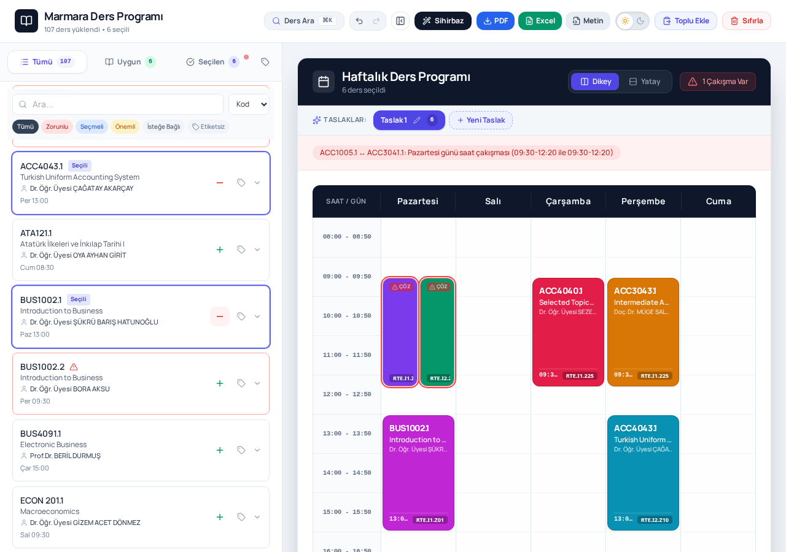
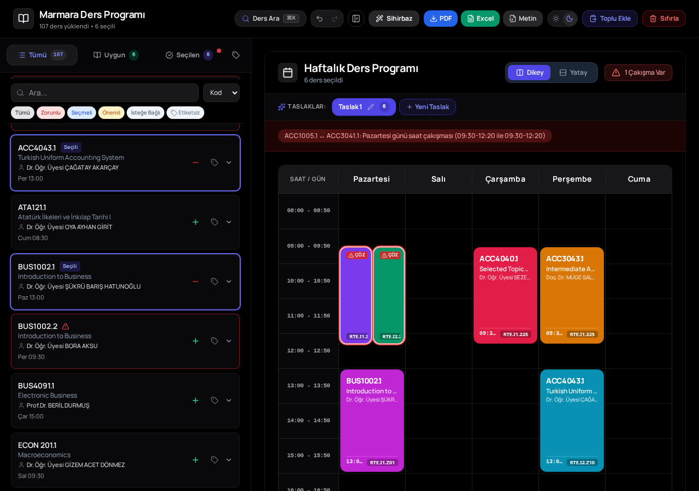
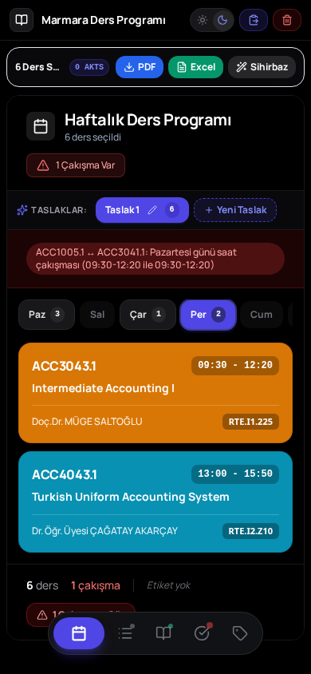

<div align="center">
    
    <h1>
        <b>Marmara Ders Programı</b>
    </h1>
    Marmara Üniversitesi öğrencileri için sunulan dersler Excel listesinden kişisel, çakışmasız haftalık ders programı oluşturan web uygulaması.
    <br>
    Tüm veriler tarayıcınızda (localStorage) saklanır; sunucu ve telemetri bağlantısı bulunmaz.
</div>

<br>

<div align="center">
    <a href="https://marmaradersprogrami.sametalkis.me/">
        
    </a>
</div>

<br>

<div align="center">
    <a href="https://marmaradersprogrami.sametalkis.me/"></a>
    <a href="https://github.com/facebook/react"></a>

<div align="center">
    <a href="https://github.com/facebook/react"></a>
    <a href="https://www.typescriptlang.org/"></a>
    <a href="https://vitejs.dev/"></a>
    <a href="https://tailwindcss.com/"></a>
    <a href="https://dndkit.com/"></a>
    <a href="https://sheetjs.com/"></a>
    <a href="https://rawgit.com/MrRio/jsPDF/master/"></a>
    <a href="https://lucide.dev/"></a>
    <a href="LICENSE"></a>
</div>

<br>

## Canlı Uygulama

Uygulamayı tarayıcınız üzerinden doğrudan kullanmak için:

**[https://marmaradersprogrami.sametalkis.me/](https://marmaradersprogrami.sametalkis.me/)**

<br>

## Ekran Görüntüleri

<p align="center">
  
</p>

<p align="center">
  
</p>

<p align="center">
  
</p>

<br>

## Özellikler

### 📚 Excel ile Ders Yükleme
- Sürükle-bırak veya dosya seçici ile `.xlsx` / `.xls` yükleme
- Otomatik parse, doğrulama ve hata bildirimi
- Marmara Üniversitesi'nin resmi "Sunulan Dersler" listesi formatını destekler

### 📖 Ders Yönetimi
- **Tüm Dersler / Uygun / Seçilen** sekmeleri ile akıllı filtreleme
- **Toplu Ekle** (Akıllı Yapıştır): Ders kodlarını metin olarak yapıştır, sistem tüm section'ları otomatik eşleştirsin
- Özel etiketler (Zorunlu, Seçmeli, Önemli, İsteğe Bağlı) ve etiket yöneticisi
- Sürükle-bırak ile ders listesi sıralama (dnd-kit)

### 🕒 Akıllı Çakışma Kontrolü
- Seçim anında otomatik saat çakışması tespiti
- Detaylı çakışma gerekçesi ("Pazartesi günü saat çakışması: 09:30-12:20 ile 09:30-12:20")
- "Yine de Ekle" ile bilinçli çakışma izni

### 📅 Program Görselleştirme
- Dikey ve yatay haftalık takvim görünümleri
- 10 renkli yüksek kontrastlı ders blokları, derslik rozetleri
- Gün bazlı mobil navigasyon

### 🧙 Otomatik Program Sihirbazı
- Seçili derslerden çakışmasız program kombinasyonlarını otomatik üretir
- Birden fazla taslak (scenario) oluşturma ve aralarında geçiş

### ⚙️ Verimlilik
- **Geri Al / İleri Al** geçmişi (⌘Z / ⌘⇧Z)
- **⌘K komut paleti** ile hızlı ders arama
- **Senaryolar**: Birden fazla program taslağı yan yana
- OLED karanlık tema dahil aydınlık/karanlık mod

### 📄 Export
- **PDF** — Canvas tabanlı çizim ile A4 yatay takvim (mobil dahil tüm cihazlarda tutarlı)
- **Excel** — Seçili derslerin tablo dökümü
- **Metin** — Ders düz metin özeti

<br>

## Teknoloji Yığını

- **React 19:** Deklaratif UI ve fonksiyonel bileşen mimarisi
- **TypeScript 5.8:** Tip güvenliği ve ölçeklenebilir veri modelleri
- **Vite 7:** Hızlı HMR ve optimize edilmiş üretim derlemesi
- **Tailwind CSS 3.4:** Utility-first stil sistemi, `dark:` varyantı ile OLED siyah tema
- **SheetJS (xlsx):** Excel dosyası okuma ve Excel export
- **jsPDF 3:** Canvas tabanlı PDF render ve indirme
- **dnd-kit:** Sürükle-bırak sıralama
- **Lucide React:** İkon seti
- **Web Storage API:** Tüm uygulama verisi için localStorage kalıcılığı

<br>

## Dizin Yapısı

```
.
├── docs/
│   └── screenshots/                  # README ekran görüntüleri
├── public/
│   └── favicon.png                   # Tarayıcı sekme ikonu
├── src/
│   ├── components/                   # Yeniden kullanılabilir UI bileşenleri
│   │   ├── ExcelUploader.tsx         # Sürükle-bırak Excel yükleme ekranı
│   │   ├── CourseList.tsx            # Ders listesi + sekmeli filtreleme
│   │   ├── CourseCard.tsx            # Tek ders kartı (+/−, etiketler)
│   │   ├── ScheduleViewer.tsx        # Haftalık takvim (dikey/yatay)
│   │   ├── ConfirmModal.tsx          # Çakışma onay penceresi
│   │   ├── AutoScheduleModal.tsx     # Otomatik program sihirbazı
│   │   ├── BatchImportModal.tsx      # Metin yapıştırarak toplu ders ekleme
│   │   ├── CommandPalette.tsx        # ⌘K hızlı arama paleti
│   │   ├── TagManager.tsx            # Özel etiket yönetimi
│   │   ├── AccordionPanel.tsx        # Katlanır panel
│   │   └── MobileBottomSheet.tsx     # Mobil alt sayfa navigasyonu
│   ├── hooks/
│   │   └── useLocalStorage.ts        # localStorage senkron state kancası
│   ├── types/
│   │   └── Course.ts                 # Ders, çakışma, senaryo tip tanımları
│   ├── utils/
│   │   ├── excelParser.ts            # Excel → Course[] parse katmanı
│   │   ├── scheduleManager.ts        # Çakışma tespiti ve ders ekleme kuralları
│   │   ├── scheduleGenerator.ts      # Otomatik çakışmasız program üretici
│   │   ├── scheduleRenderUtils.ts    # Ders renk paleti ve takvim yardımcıları
│   │   ├── courseCodeExtractor.ts    # Serbest metinden ders kodu çıkarma
│   │   └── exportUtils.ts            # PDF (canvas) / Excel / Metin export
│   ├── App.tsx                       # Uygulama kabuğu, header araç çubuğu, durum yönetimi
│   ├── main.tsx                      # React DOM giriş noktası
│   └── index.css / App.css           # Tailwind katmanları ve özel stiller
├── index.html                        # PWA meta etiketleri ve tema-color
├── tailwind.config.js                # Tailwind yapılandırması
├── postcss.config.js                 # PostCSS (Tailwind) yapılandırması
├── eslint.config.js                  # ESLint yapılandırması
├── tsconfig*.json                    # TypeScript proje yapılandırması
├── vite.config.ts                    # Vite yapılandırması
├── wrangler.jsonc                    # Cloudflare Pages yapılandırması
└── package.json                      # Bağımlılıklar ve npm scriptleri
```

<br>

## Kurulum ve Yerel Geliştirme

### Gereksinimler
- Node.js (>= 18.0.0)
- npm (>= 9.0.0)

### 1. Depoyu Klonlayın
```bash
git clone https://github.com/sametalkis/marmaradersprogrami.git
cd marmaradersprogrami
```

### 2. Bağımlılıkları Yükleyin
```bash
npm install
```

### 3. Geliştirme Sunucusunu Başlatın
```bash
npm run dev
```
Uygulama yerel olarak `http://localhost:5173` adresinde çalışacaktır.

### 4. Tip Kontrolü ve Derleme
```bash
# Üretim derlemesi (TypeScript tip kontrolü dahil)
npm run build

# Üretim derlemesini önizleme
npm run preview

# ESLint kod kontrolü
npm run lint
```

<br>

## Kullanım

### 1. Excel Dosyasını Yükleyin
Uygulamayı açtığınızda Excel dosyanızı sürükleyip bırakın veya **Dosya Seç** ile seçin.

### 2. Derslerinizi Seçin
- **Tüm Dersler** sekmesinden **+** ile ders ekleyin
- Veya **Toplu Ekle** ile ders kodlarını metin olarak yapıştırın
- Çakışan bir ders eklerseniz uygulama sizi uyarır; **Yine de Ekle** ile devam edebilirsiniz

### 3. Programınızı Görüntüleyin ve Dışa Aktarın
- Sağ panelden haftalık takviminizi görün (Dikey/Yatay)
- **Sihirbaz** ile çakışmasız alternatif kombinasyonlar üretin
- **PDF / Excel / Metin** butonlarıyla programınızı indirin

<br>

## Veri Modeli ve Gizlilik

Tüm kullanıcı verileri tarayıcının yerel depolama alanında (`localStorage`) `marmara-*` anahtarları altında saklanır:

- `marmara-courses`: Yüklenen ders listesi ve seçim durumları
- `marmara-custom-tags`: Kullanıcı tanımı özel etiketler
- `marmara-scenarios`: Program taslakları (senaryolar)
- `marmara-active-scenario`: Aktif senaryo kimliği
- `marmara-theme`: Tema tercihi (light / dark)

Uygulama harici sunucuya veri göndermez, telemetri içermez ve hesap gerektirmez. Sayfa yenilendiğinde veya tarayıcı kapatılsa bile veriler korunur; **Sıfırla** butonu ile her şey temizlenebilir.

<br>

## Katkıda Bulunma

1. Depoyu forklayın (`Fork`).
2. Özellik dalı oluşturun (`git checkout -b feature/yeni-ozellik`).
3. Değişikliklerinizi commit edin (`git commit -m 'feat: add new feature'`).
4. Dalınıza push yapın (`git push origin feature/yeni-ozellik`).
5. Bir Pull Request açın.

<br>

## Lisans

Bu proje **GNU General Public License v3.0 (GPL-3.0)** altında lisanslanmıştır. Detaylar için [LICENSE](LICENSE) dosyasına bakınız.

---

**Marmara Üniversitesi öğrencileri için geliştirilmiştir. 🎓**
